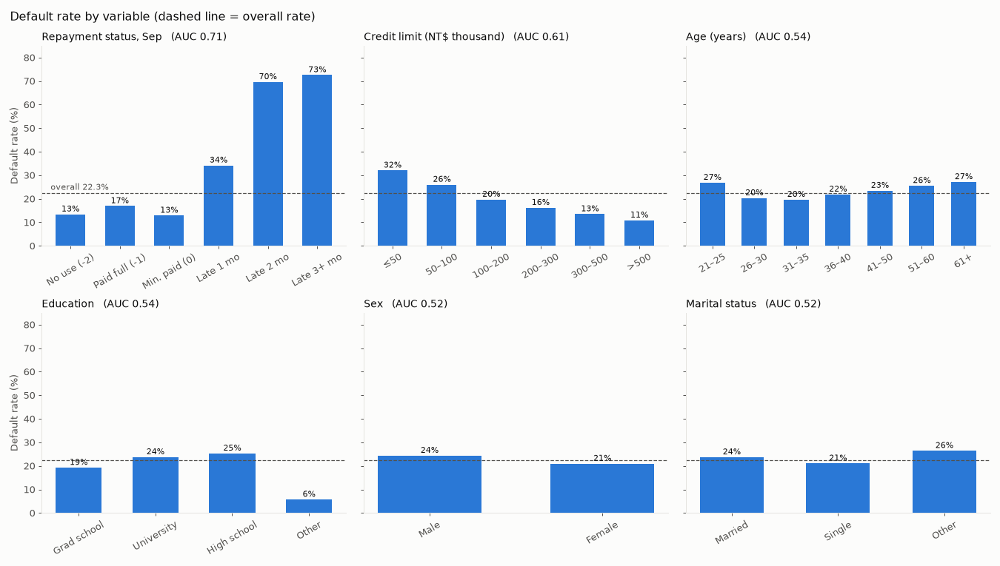
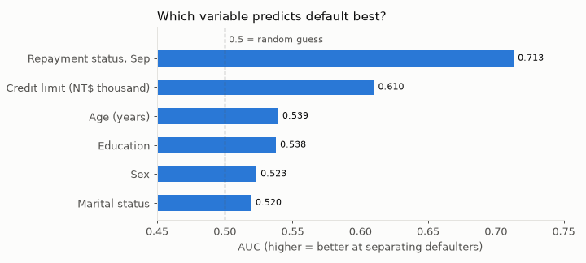

# Part 1 — ทำความสะอาดข้อมูล (UCI Credit Card Default)

รันบน **Google Colab** โดยอ่านไฟล์จาก Google Drive
ผลลัพธ์: `UCI_Credit_Card_clean.csv` บันทึกไว้ folder เดียวกับไฟล์ต้นฉบับใน Drive (29,601 แถว, 33 คอลัมน์)

## การตั้ง path ไฟล์ (Google Drive)
1. อัปโหลด `UCI_Credit_Card.csv` ไว้ที่ไหนก็ได้ใน Drive (หรืออัปโหลดเข้า Colab ตรง ๆ ก็ได้)
2. รัน cell แล้ว Colab จะขออนุญาตเชื่อม Drive

สคริปต์จะ:
- `drive.mount(...)` เชื่อม Drive เข้ากับ `/content/drive`
- `find_file` ใช้ `os.walk` ไล่หา **ไฟล์** ชื่อ `DATA_FILE` ทุกชั้นใน `MyDrive`, `Shareddrives` และ `/content` (ไม่สนตัวพิมพ์เล็ก/ใหญ่ และรับชื่อที่ Drive เติม ` (1)` ตอนอัปซ้ำได้)
- ถ้ามีไฟล์ชื่อนี้หลายที่ ให้ตั้ง `DATA_FOLDER = "ชื่อ folder"` เพื่อบังคับว่าจะเอาจาก folder ไหน
- ถ้าหาไม่เจอ จะแสดงรายชื่อ .csv ที่เจอใน Drive ให้เทียบว่าชื่อจริงคืออะไร
- พิมพ์ path จริงของ folder, input และ output ออกมาให้ตรวจ

ถ้ารันนอก Colab (ไม่มี `google.colab`) จะค้นหาจาก folder ที่รันแทน

## สรุปสิ่งที่พบและวิธีจัดการ

| ปัญหา | สิ่งที่พบ | วิธีจัดการ | เหตุผล |
|---|---|---|---|
| ค่า NaN | 0 | ไม่ต้องทำอะไร | ไม่มีช่องว่างในไฟล์เลย |
| EDUCATION = 0, 5, 6 หรือ MARRIAGE = 0 | 399 แถว (1.3%) — EDUCATION 5, 6 = "ไม่ทราบ" ตามเอกสาร, EDUCATION 0 และ MARRIAGE 0 = ไม่มีในเอกสาร | **ตัดแถวออก** | ตีความไม่ได้ และเป็นข้อมูลหมวดหมู่ที่เติมค่าแทนอย่างสมเหตุสมผลไม่ได้ (เติมด้วยค่าที่พบบ่อยก็คือการเดา) ตัดแค่ 1.3% ยังเหลือ 29,601 แถว อัตรา default เปลี่ยนเพียง 22.1% → 22.3% **ข้อจำกัด:** กลุ่มที่ตัดผิดนัดเพียง 7.8% ต่ำกว่าค่าเฉลี่ย ข้อมูลที่เหลือจึงเอียงไปทางความเสี่ยงสูงขึ้นเล็กน้อย แต่กลุ่มนี้เล็กจึงกระทบน้อย |
| PAY_x = -2 และ 0 | มีหลายหมื่นค่า (0 เป็นค่าที่พบบ่อยที่สุด) | **เก็บรหัสเดิมไว้** และสร้าง `DELAY_1..6` = จำนวนเดือนที่ค้าง (≤0 → 0) | เอกสารบอกแค่ -1 = จ่ายตรงเวลา และ 1–9 = ค้าง n เดือน แต่ผู้จัดทำข้อมูลชี้แจงภายหลังว่า -2 = ไม่มีการใช้บัตร, 0 = จ่ายขั้นต่ำ (มียอดยกไป) ทั้งสามรหัสคือ "ยังไม่ค้าง" แต่พฤติกรรมต่างกัน จึงเก็บรหัสเดิมไว้ด้วยเพื่อไม่ให้ข้อมูลหาย มีมากเกินกว่าจะมองว่าเป็นค่าผิดพลาด |
| ID ซ้ำ / แถวซ้ำทั้งแถว | 0 / 0 | ไม่ต้องทำอะไร | — |
| feature เหมือนกันแต่ ID ต่างกัน | 108 แถว ใน 52 กลุ่ม | **ไม่ลบ** ทำธง `DUP_PROFILE` | ID ต่างกัน = คนละบัญชี 90% เป็นบัญชีที่ยอดบิล/ยอดจ่ายเป็น 0 ทั้งหมด (บัญชีที่ไม่ได้ใช้) จึงซ้ำกันได้ง่ายโดยบังเอิญ และ 21 กลุ่มมีผล default ต่างกัน แปลว่าเป็นคนละคนจริง การลบทิ้งจะทำให้บัญชีที่ไม่ได้ใช้มีน้อยกว่าความเป็นจริง |
| BILL_AMT ติดลบ | 1,930 แถว | เก็บไว้ + ธง `HAS_CREDIT_BALANCE` | ยอดติดลบ = ลูกค้าจ่ายเกิน (มีเครดิตคงเหลือ) ซึ่งเกิดขึ้นได้จริง ไม่ใช่ข้อผิดพลาด |
| AGE, LIMIT_BAL, PAY_AMT | อยู่ในช่วงที่สมเหตุสมผล (อายุ 21–79, วงเงิน ≥10,000, ไม่มียอดจ่ายติดลบ) | ไม่ต้องทำอะไร | ค่าสุดขั้วยังเป็นไปได้ จึงไม่ตัดออก outlier ไว้ค่อยดูใน part ถัดไป |

## เปลี่ยนแปลงอื่น ๆ
- `PAY_0` → `PAY_1` ให้เลขเดือนตรงกับ `BILL_AMT1` / `PAY_AMT1` (ก.ย. 2005)
- `default.payment.next.month` → `DEFAULT` (ชื่อที่มีจุดใช้ใน pandas ลำบาก)
- คอลัมน์ยอดเงินแปลงจาก float เป็น int (ค่าเป็นจำนวนเต็มอยู่แล้ว)
- ตัดแถวที่การศึกษา/สถานภาพเป็น "ไม่ทราบ" 399 แถว เหลือ 29,601 แถว (EDUCATION รหัส 1–4, MARRIAGE รหัส 1–3)

## โค้ดทำงานยังไง
1. `load_data` — อ่าน CSV และนับสตริงอย่าง `"NA"`, `"?"` ให้เป็น NaN ด้วย
2. `check_missing` — นับ NaN และ "ค่าหายแบบแฝง" (รหัสที่แปลว่าไม่ทราบ)
3. `check_duplicates` — ตรวจ ID ซ้ำ แถวซ้ำ และแถวที่ข้อมูลเหมือนกันเมื่อไม่นับ ID/target จากนั้นดูว่ากลุ่มเหล่านั้นมีผลลัพธ์ต่างกันไหม
4. `check_undocumented_codes` — เทียบค่าจริงกับรหัสในเอกสาร (`DOCUMENTED_CODES`)
5. `check_numeric_ranges` — ดู min/max และค่าที่ติดลบหรือผิดปกติ
0. ส่วนตั้งค่า path — เชื่อม Drive, หาไฟล์ด้วย `find_file` แล้วกำหนด `INPUT_PATH` / `OUTPUT_PATH`
6. `clean` — แก้ตามตารางด้านบน (ทำธง `DUP_PROFILE` ก่อนตัดแถว เพราะคำนวณจากข้อมูลเต็ม) แล้วบันทึกไฟล์
7. `summary_table` — ตารางสรุปว่าแต่ละปัญหามีกี่แถว กี่ % และจัดการอย่างไร (ใน Colab แสดงเป็นตาราง HTML)

**ตารางสรุปข้อมูลหลังคลีน:** รัน `part1_summary_tables.py` ใน cell ถัดไป ได้ 5 ตาราง — ภาพรวม, พจนานุกรมตัวแปร, ตัวแปรหมวดหมู่ (จำนวน/%/อัตรา default), ตัวแปรตัวเลข (mean/median/SD/min/max), สถานะการชำระรายเดือน

---

# Part 2 — อัตราการผิดนัดชำระหนี้

รัน `part2_default_rate.py` ใน cell ถัดไป (ต้องมี `UCI_Credit_Card_clean.csv` จาก Part 1)

- **อัตราผิดนัดชำระโดยรวม: 22.3%** (6,605 จาก 29,601 คน)
- ดูอัตราแยกตาม 6 ตัวแปร: สถานะชำระเดือน ก.ย. (`PAY_1`), วงเงิน, อายุ, การศึกษา, เพศ, สถานภาพ
- วัดความสามารถทำนายด้วย **ช่วงห่าง** (อัตรากลุ่มสูงสุด − ต่ำสุด, เฉพาะกลุ่ม ≥ 100 คน) และ **AUC** (ใช้อัตรา default ของกลุ่มเป็นคะแนน; 0.5 = เดาสุ่ม, 1 = สมบูรณ์)

| อันดับ | ตัวแปร | ต่ำสุด → สูงสุด | ช่วงห่าง | AUC |
|---|---|---|---:|---:|
| 1 | สถานะชำระ ก.ย. (`PAY_1`) | 12.9% (จ่ายขั้นต่ำ) → 72.5% (ค้าง 3+ เดือน) | 59.7 | 0.713 |
| 2 | วงเงิน (`LIMIT_BAL`) | 10.8% (>500k) → 32.0% (≤50k) | 21.2 | 0.610 |
| 3 | อายุ | 19.6% (31–35) → 27.1% (61+) | 7.5 | 0.539 |
| 4 | การศึกษา | 5.7% (อื่น ๆ) → 25.3% (ม.ปลาย) | 19.6 | 0.538 |
| 5 | เพศ | 21.0% (หญิง) → 24.4% (ชาย) | 3.4 | 0.523 |
| 6 | สถานภาพ | 21.1% (โสด) → 26.4% (อื่น ๆ) | 5.3 | 0.520 |

**ตัวแปรที่ทำนายได้ดีที่สุด: สถานะการชำระเดือนล่าสุด (`PAY_1`)** — คนที่ค้าง 2 เดือนขึ้นไปผิดนัดราว 70% เทียบกับ 13–17% ของคนที่ไม่ค้าง

---

# Part 3 — สร้างคุณลักษณะจากข้อมูลย้อนหลัง 6 เดือน

รัน `part3_features.py` (cell เดียวจบ) — บันทึก `UCI_Credit_Card_features.csv` ไว้ทำโมเดลต่อ

| คุณลักษณะ | สูตร | อัตราผิดนัด ต่ำสุด → สูงสุด | AUC |
|---|---|---|---:|
| `N_LATE_MONTHS` จำนวนเดือนที่ค้าง | นับเดือนที่ `DELAY_i > 0` | 11.8% (0 เดือน) → 64.2% (4–6 เดือน) | 0.726 |
| `MAX_DELAY` ค้างร้ายแรงสุด | `max(DELAY_1..6)` | 11.8% (ไม่เคยค้าง) → 63.1% (3+ เดือน) | 0.716 |
| `PAY_RATIO` จ่ายต่อบิล | `ΣPAY_AMT1..5 ÷ ΣBILL_AMT2..6` (จ่ายเดือนนี้ = จ่ายบิลเดือนก่อน), ตัดที่ 0–1 | 14.9% (20–50%) → 28.8% (<5%) | 0.588 |
| `AVG_UTIL` ใช้วงเงินเฉลี่ย | `mean(max(BILL_i,0) ÷ LIMIT_BAL)` | 15.7% (10–30%) → 32.2% (≥80%) | 0.564 |
| `UTIL_TREND` แนวโน้มใช้วงเงิน | ความชันของอัตราใช้วงเงิน เม.ย.→ก.ย. (จุด%/เดือน) | 16.1% (เพิ่มขึ้น) → 29.6% (ลดลง) | 0.554 |

เทียบ: `PAY_1` อย่างเดียว AUC 0.690 — คุณลักษณะที่ดูประวัติ 6 เดือน (`N_LATE_MONTHS`, `MAX_DELAY`) ทำนายได้ดีกว่า
